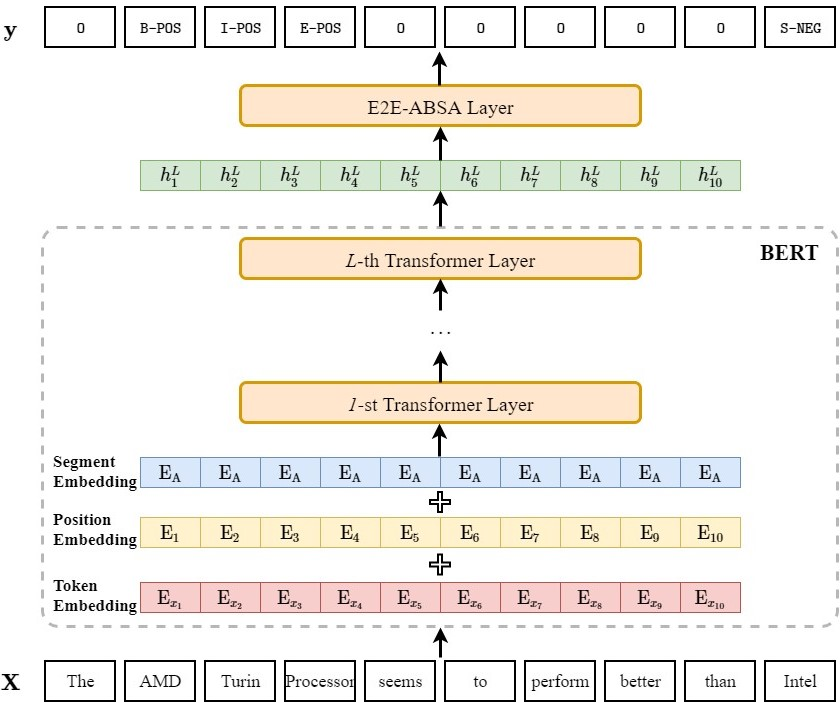

# russian-reviews-bert-e2e-absa

Exploiting **BERT** **E**nd-**t**o-**E**nd **A**spect-**B**ased **S**entiment **A**nalysis

    

## Architecture
* Pre-trained embedding layer: Conversational RuBERT, Russian, cased, 12-layer, 768-hidden, 12-heads, 180M parameters [huggingface](https://huggingface.co/DeepPavlov/rubert-base-cased-conversational), [docs](http://docs.deeppavlov.ai/en/master/features/models/bert.html).
* Task-specific layer: 
  - Linear
  - Recurrent Neural Networks (GRU)
  - Self-Attention Networks (SAN, TFM)
  - Conditional Random Fields (CRF)
  
## Task
You have a sentence like this:

> Средняя продолжительность жизни в рэфии 63 года у мужиков пенсия в 65 ... .травят едой из монеток и **ENT** соевой и пальмовой .рэфия занимает первое место среди стран третьего мира по смертности от сердечно сосудистых заболеваний .ни вывозит сердечко говноеды из эрзац продуктов отложение бляшек в виде холестерина херакс и тромб

Which contains a special token ENT. This token masks our point-of-interest, an aspect for which we should determine its sentiment using other tokens as a context. For this particular example, you can clearly determine that ENT was used in negative sense (that's obvious - the whole sentence is depressingly negative).

## Dataset
You can find the original dataset [here](https://drive.google.com/drive/folders/1xAnbhBhnh__wDPKEuvF_-M1skLt-kUWa?usp=sharing) and preprocessed dataset [here](https://drive.google.com/drive/folders/1--pUlrI1EnUfzwPmxdjCutOqqu6faQMa?usp=sharing).

This dataset consists of scraped russian news articles, comments, reviews, marketplace item descriptions etc. 

Each text item has specified sentiment (1 - positive, 0 - neutral, -1 - negative).

Each entity of interest is masked with ENT tag.

## Quick Start
* The valid tagging strategies/schemes (i.e., the ways representing text or entity span) in this project are **BIEOS** (also called **BIOES** or **BMES**), **BIO** (also called **IOB2**) and **OT** (also called **IO**). If you are not familiar with these terms, I strongly recommend you to read the following materials before running the program: 

  1. [Inside–outside–beginning (tagging)](https://en.wikipedia.org/wiki/Inside%E2%80%93outside%E2%80%93beginning_(tagging)). 
  
  2. [Representing Text Chunks](https://www.aclweb.org/anthology/E99-1023.pdf). 
  
  3. The [paper](https://www.aclweb.org/anthology/D19-5505.pdf) associated with project. 

* **Train** the model on other ABSA dataset:
  1. Place data files in the directory `./data/[YOUR_DATASET_NAME]` (please note that you need to re-organize your data files so that it can be directly adapted to this project, following the input format of `./data/train.txt` should be OK).
  2. Set `TASK_NAME` in `train.sh` as `[YOUR_DATASET_NAME]`.
  3. Train the model:  `sh train.sh`

* Perform pure **inference/direct transfer** over test/unseen data using the trained ABSA model:
  1. place data file in the directory `./data/[YOUR_EVAL_DATASET_NAME]`.
  2. set `TASK_NAME` in `work.sh` as `[YOUR_EVAL_DATASET_NAME]`
  3. set `ABSA_HOME` in `work.sh` as `[HOME_DIRECTORY_OF_YOUR_ABSA_MODEL]`
  4. run: `sh work.sh`
  
## Results
| Dataset | Precision | Recall | F1 (macro) | F1 (micro) |
| ------- | --------- | ------ | ---------- | ---------- |
| Test    | 76.43     | 76.35  | 75.82      | 76.34      |

## References
1. Li, X., Bing, L., Zhang, W., & Lam, W. (2019). Exploiting BERT for end-to-end aspect-based sentiment analysis. arXiv preprint arXiv:1910.00883.
